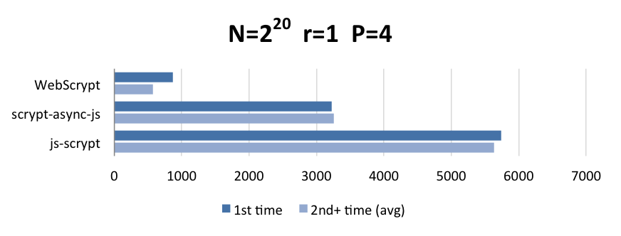

# WebScrypt

一个浏览器版的 scrypt 算法，性能高、体积小。


## scrypt 简介

[scrypt](https://en.wikipedia.org/wiki/Scrypt) 是一种密码学 Hash 函数，专门用于 Hash 口令。

不同于 PBKDF2、bcrypt 只有`时间成本`，scrypt 还可设定`空间成本`，该特征能使 GPU 等硬件设备破解 Hash 时瓶颈出现在内存上，从而降低硬件的计算优势。

另外 scrypt 支持`并发维度`，可充分利用多线程提高工作量，使破解时间成倍增加。[详细讲解](https://www.cnblogs.com/index-html/p/hardware-resistant-hash-algorithm.html)


## 前端计算

口令 Hash 函数的计算成本，决定了暴力破解的难度。但过高的成本，也会给服务器带来压力。因此通常只能在性能和安全之间折中。

事实上，口令 Hash 完全可在前端计算 —— 账号注册时，提交口令的 Hash 值（通常称之 DK）；登录时，如果提交的 DK 相同，即可证明口令是相同的。

```javascript
// REG or LOGIN
dk = scrypt(password, username, cost ...)

submit(username, dk, ...)
```

前端高成本 Hash 计算，不仅分担了后端压力，还能让原始口令数据更早消失，从而减少泄露环节，例如网络被窃听、服务端恶意程序等。

这就是本项目的初衷：在不增加网站基础设施的前提下，大幅提升账号口令安全。


## API

* [使用文档](doc/api.md)


## 演示

* [基本功能](example/basic/)

* [登录演示](example/login/)


## 如何用到我的项目中？

更新中...


## 各种浏览器的性能对比

更新中...


## 其他的前端 scrypt 库

| project                                                      | ver    | asm.js | flash | purejs | thread | progress | size (gzip -6)    |
|:------------------------------------------------------------:|:------:|:------:|:-----:|:------:|:------:|:--------:|------------------:|
| **WebScrypt**                                                | latest |   ✔    |   ✔   |   ✘    |   ✔    |    ✔️     | 2KB + 10KB / 54KB |
| [js-scrypt](https://github.com/tonyg/js-scrypt)              | 1.2.0  |   ✔    |   ✘   |   ✘    |   ✘    |    ✘     |             384KB |
| [scrypt-async-js](https://github.com/dchest/scrypt-async-js) | 1.3.0  |   ✘    |   ✘   |   ✔    |   ✘    |    ✔     |               3KB |

> 备注：54KB 的是 `flash.swf` 文件，只有低版本浏览器才会使用


### 单线程性能


### 多线程性能




## 探讨

探讨一些前端技术、隐私安全相关的话题。

* [为何不选择 argon2 算法](doc/why-not-argon2/README.md)

* [前端 Hash 能否对抗不安全的通信](doc/client-hash-via-insecure-network/README.md)

* [「安全输入框插件」能否有效地保护输入数据](doc/security-plugin-protect-input/README.md)

* 更多内容，敬请关注 ...
