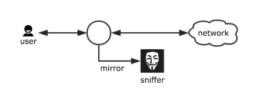
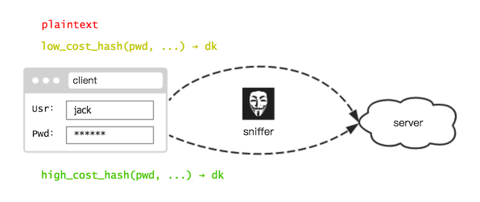
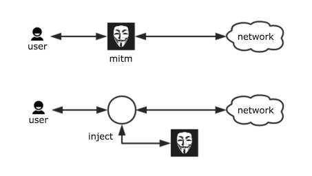
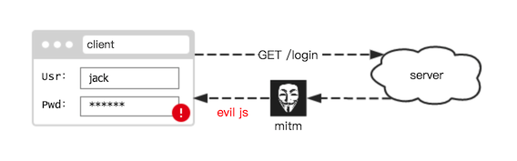

# 前端 Hash 能否对抗不安全的通信

本项目的简介里提到，前端使用 WebScrypt 脚本 Hash 口令，可对「隐私嗅探」起到一定的防护。

当然现在不少网站部署了 HTTPS 协议，因此无需再考虑通信风险。但对于仍在使用 HTTP 的网站，前端 Hash 又能起到多大的效果？

## 攻击类型

通信上的攻击，通常可分「嗅探」和「劫持」。

### 嗅探

嗅探，即攻击者窃听通信流量。

假如我们的登录过程被嗅探，那么前端提交的 dk 就会泄露。而 dk 是身份凭据，泄露即意味着 **攻击者用它也能登上该账号**。所以账号被盗用，显然是无法避免的。

不过，相比传统提交，风险其实已降低了不少 —— 传统提交，口令大多是毫不避讳，直接明文发送的。（当然有些开发者会用公钥加密口令，这确实能有效对抗嗅探攻击）

而现在，攻击者嗅探到却是的 dk，这是口令经过 **高成本 Hash** 的计算结果。攻击者若想通过 dk 还原口令，得花费巨大的算力。

因此最终：账号被盗，口令拿不到。那些使用类似口令的其他账号，就幸免于难了。

> 注意，这里的「被盗」是指能被攻击者使用，但未必就能改掉口令。后续文章会讨论这个问题。

### 劫持

嗅探是静默的，通常不篡改或注入流量。因此流量只是失去了隐蔽性，并没有破坏完整性。

然而现实中，攻击者大多有主动出击的能力。例如中间人攻击，或是数据包注入，能对流量实施篡改。

既然能修改流量内容，攻击者即可往登录页面中植入一段 JS 恶意代码，这样就能从应用层发起攻击，直接读取表单元素的口令值。

事实上，用户在页面中的一举一动，都能被恶意代码所监控，甚至在提交之前，输入的内容就已被悄悄发送到后台了。

因此对于流量劫持，前端 Hash 是无法防止口令泄露的。

## 结论

在不安全的通信下，使用前端 Hash 的效果：

* 对于嗅探，虽不能防止账号被盗用，但可有效防止明文口令泄露。

* 对于劫持，明文口令仍能轻易窃取。

所以前端 Hash 只能起到部分效果，无法代替 HTTPS 的功能。
