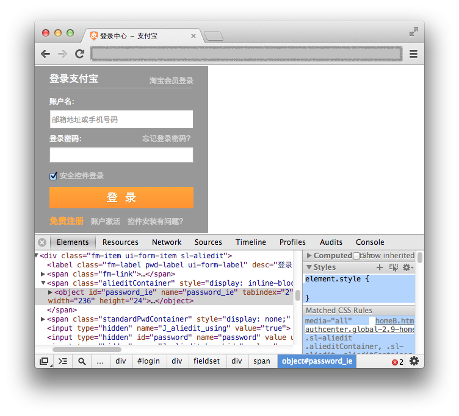
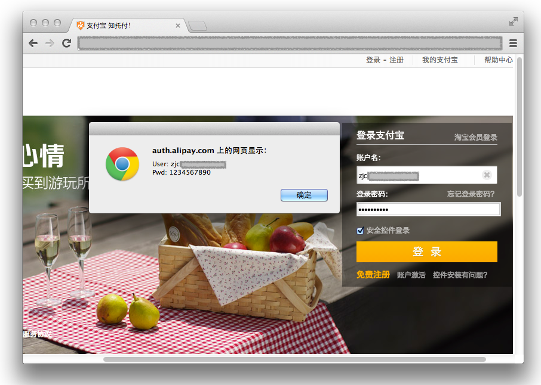

# 「安全输入框插件」能否有效地保护输入数据

不少安全性较高的网站，会提供一个安全输入框插件，用户必须下载安装后，才能输入账号口令等数据。例如各大网银的登录页面，相信大家都见过。

下面我们来探讨，这类安全插件对用户输入的数据，究竟能起到多大的保护效果。

## 对抗

稍了解编程的朋友都知道，用户在安全框内输入时，其他程序是无法通过简单的技术手段，来截获按键消息的。因为插件会从最底层的键盘驱动中取走消息，保障按键过程无法被轻易窃听。

同时，也无法简单地通过内存扫描等手段，获取控件内部的数据。所以从系统攻防上，这类插件还是有一定保护效果的。

但是，攻击者非得从系统攻防上进行对抗吗？


## 绕过

我们先来聊一个其他话题。大家都知道 HTTPS 是难以破解的，但这并不意味它就是无懈可击的。例如某些场合下，使用类似 SSLStrip 的工具，就能让用户进不了 HTTPS —— 我们虽然不能解决问题，但能回避问题。

类似的，对于安全输入框，我们也可设法回避它。例如，支付宝曾经使用的登录插件（几年前的截图）：



从系统攻防的角度来看，它是管用的。恶意程序想通过按键窃听口令，并不十分容易。至于想靠页面中的 JS 来捕获键盘事件，那更是天方夜谭。

然而事实上，用 JS 攻击才是最容易、最可行的。并不是因为这个插件存在什么接口、暴露了什么隐私，而是，这里根本就用不着插件！

如果能运行 JS，我们只需简单地删除插件 DOM，然后**通过 HTML 画个相似的输入框**，就能钓到用户口令了:)

```javascript
$('.alieditContainer').html(
    '<input type="password" style="width:100%; border:double 3px #ccc" />'
);
```

至于用户无法正常登录，我们并不用关心，反正我们已经拿到明文口令了 —— 虽然未必正确，但正确的可能性是很大的。另外，也不必每次都劫持，让用户仍能正常登陆。



由此看来，程序的安全等级，并不能只看权限的高低。启动的先后顺序，更是直接决定了生死。

如果某个恶意程序在系统攻防上并不突出，却有注入 JS 到浏览器页面的能力，同样能绕过这类插件，直接获取用户的输入信息。


## 结尾

所以光靠独立的插件，并不能十分有效地保护输入信息。还需结合优先级更高的系统服务共同防护，才能起到更好的效果。

当然，安全插件并不仅仅是为了提供输入环境，还有读取 USBkey、采集系统信息等更多操作。这些功能浏览器大多不支持，所以只能通过插件来实现 —— 既然有了插件，于是就干脆就加上输入防护的功能，有防护总比没有好吧。
